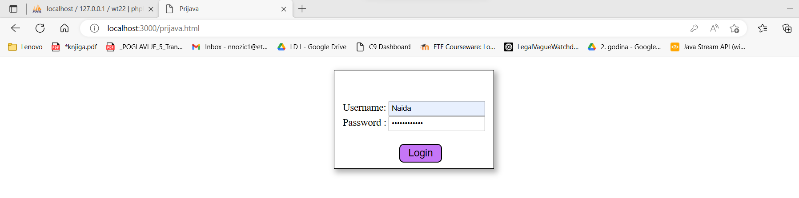
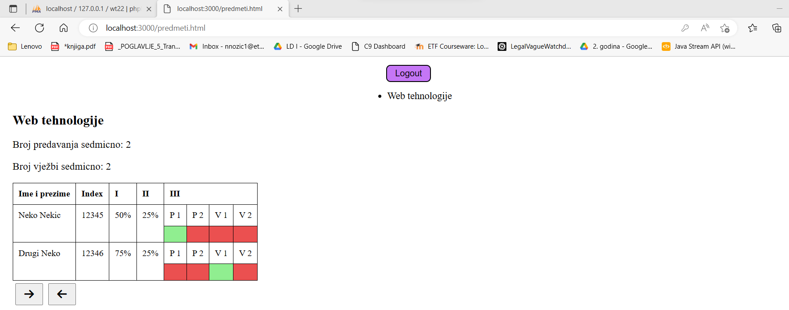
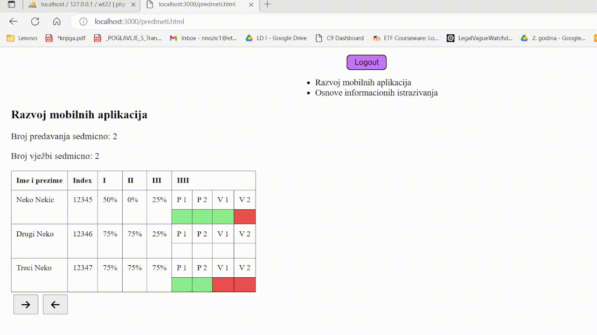

# WT-project
<h3>The project was made as part of the course "Web technologies".</h3>
The web application is an "Attendance manager" for professors, which supports funcionalities such as: 

<ul>
<li>Log in/out</li>
<li>Attendance review</li>
<li>Attendance entry</li>
</ul>

<h3>Instructions:</h3>
Create a database with the following parametres: 
<ul>
<li>Name: wt22</li>
<li>Username: root</li>
<li>Password: password</li>
</ul>

Before running the application, first run <b>"node priprema.js"</b> and then <b>"node index.js"</b>.

<h3>System functionalities:</h3>

1. Log in

2. After successful log in

3. Attendance entry

